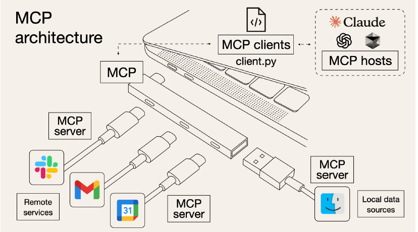
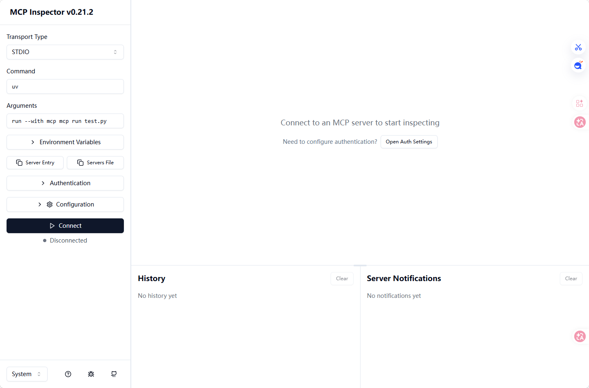
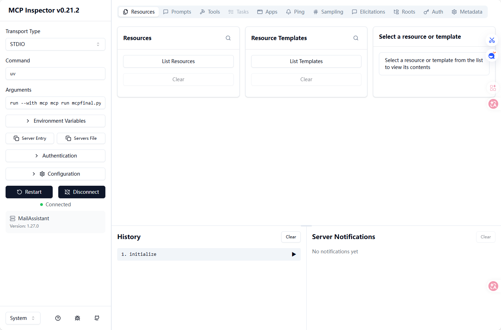
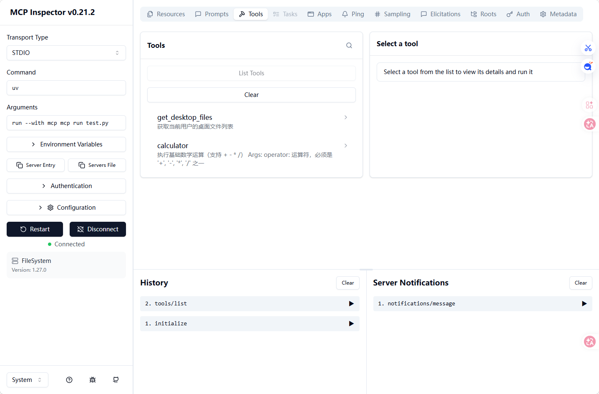
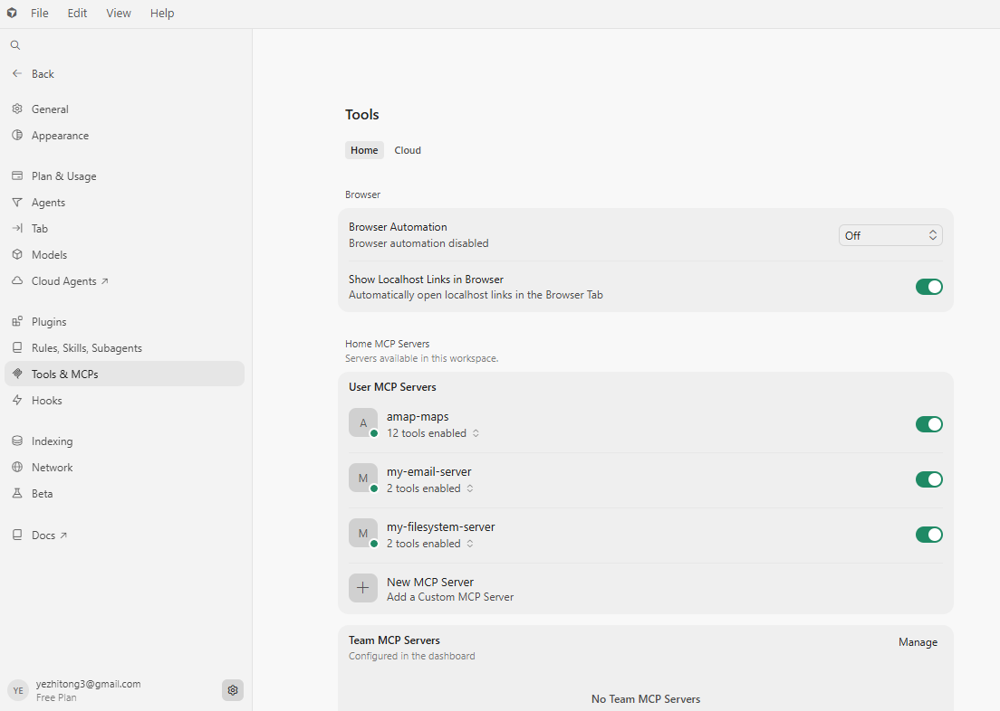
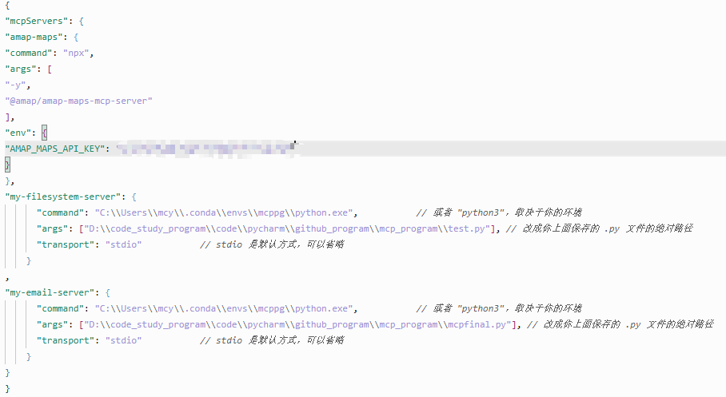
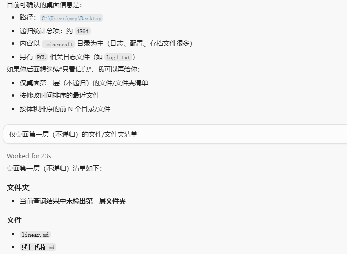
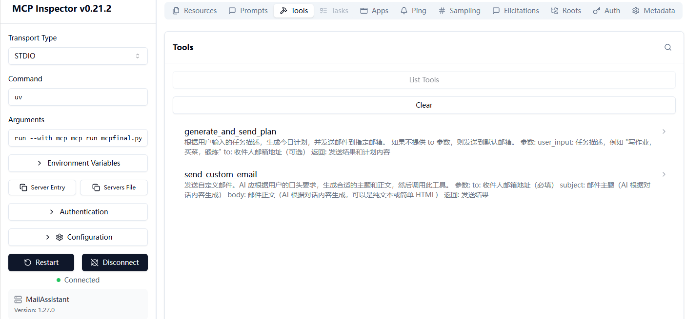
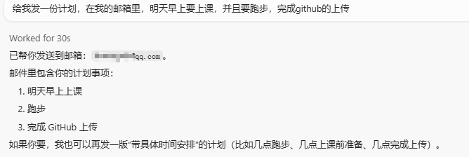

# mcp_program
## mcp简绍
MCP 即模型上下文协议（Model Context Protocol），是一种开放的通信协议，是人工智能领域的“USB接口”。
MCP 在大模型和外部数据源（数据、工具、开发环境等）之间建立了双向且更加安全的连接，使用单一的标准协议取代碎片化的集成方式。
如果把 LLM比作人的大脑，MCP 就是手脚。LLM不断提升智能下限，MCP则是不断提升创意上限。
***
**在 MCP 出现前，大模型和数据源之间是如何连接的？**  
利用 API 接口：如果数据源提供了 API 接口，开源大模型可以通过调用 API 来获取数据，包括数据的读取和写入等操作。
基于特定代码编写：开发者针对具体的开源大模型和数据源，依据其各自的接口规范与数据格式要求，使用编程语言（如 Python）编写连接代码。
以连接 MySQL 数据库与开源大模型为例，可利用 Python 的pymysql库来建立数据库连接，获取数据后进行处理和转换，使其能被大模型理解和使用。  
**AI 应用开发平台&编程框架**  
- LangChain：是一个用于开发由语言模型驱动的应用程序的框架，能将开源大模型与各种数据源集成。
如可以通过 LangChain 的SQLDatabaseChain将大模型与关系型数据库连接，实现基于数据库数据的问答等功能。
- LlamaIndex：主要用于构建向量数据库索引，方便大模型高效检索和利用数据。
能将文本数据等处理成向量形式存入向量数据库，如 Pinecone 等，大模型在运行时可快速从向量数据库中获取相关上下文信息。  
- Dify&百炼：低代码 AI 应用开发平台，支持将开源大模型与多种数据源连接。
用户通过简单的配置和少量代码，就能让大模型访问数据库、文件存储等数据源中的数据。
采用插件系统：部分大模型有插件系统，类似于 OpenAI 的 ChatGPT 插件。
开发者可开发插件来连接特定数据源，比如开发一个连接企业内部知识库的插件，使大模型能获取知识库中的信息进行回答。   
***
>*MCP 的出现给开发者们提供了更多的选项，省去了接口代码的编写和维护工作。*  


## 文件位置
```
│  LICENSE        # MIT许可证
│  mcpfinal.py    # mcp个人项目文件
│  mcp_test1.py   # mcp个人测试文件
│  README.md      # 项目介绍
│  test.py        # 项目测试文件
│  test_send_email.py # 测试发送邮件
└─markdown图片使用
```

## mcp使用
### mcp安装和环境配置
#### 坏境配置
```
Python>=3.13
mcp>=1.0.0
yagmail>=0.15.0
uv>=0.11.7
```
#### 安装MCP
>*注意*：安装Node.js https://nodejs.org/en/download  

安装MCP客户端软件，这里选取两个  
1. Cherry studio https://docs.cherry-ai.com/
2. Cursor https://cursor.com/cn
### mcp使用和测试
必须安装的库
```
pip install mcp
pip install mcp[cli]
```
#### MCP Inspector
mcp inspector是一个用于检查MCP连接的命令行工具。  
运行`mcp dev test.py`可以测试MCP连接。

然后点击connect按钮，进行测试。  
如果测试成功，则返回如下结果：  
  
如果不是，升级下uv版本，导致无法测试成功  
## mcp测试部署
这个项目是一个使用MCP的示例项目，其功能是加减法，获取桌面文件名称  
### mcp在服务器部署
启动命令，在终端没有任何输出，服务启动成功，持续运行中`python test.py`  
如果测试下mcp工具，可以用`mcp dev test.py`进行测试  

### mcp在客户端部署
我的客户端是在cursor中部署
要在这里配置mcp连接  
  
其代码为：
```
{
"mcpServers": 
{
"amap-maps": 

{
"command": "npx",
"args": [
"-y",
"@amap/amap-maps-mcp-server"
],
"env": {
"AMAP_MAPS_API_KEY": "你的秘钥"
}
},
"my-filesystem-server": 

{
      "command": "环境配置",  // 或者 "python3"，取决于你的环境
      "args": ["你的服务端.py 文件"], // 改成你上面保存的 .py 文件的绝对路径
      "transport": "stdio" // stdio 是默认方式，可以省略
}

}
}
```
`amap-maps`：高德地图的mcp调用  
`my-filesystem-server`：文件系统服务（个人服务端的文件mcp）  
也可以在后面添加其他服务  
  
最终运行结果
  
## mcp个人项目部署
该项目是邮箱发送并且生成当天计划和发送自定义邮件
其文件为`mcpfianl.py`
### mcp在服务器部署
启动命令，在终端没有任何输出，服务启动成功，持续运行中`python mcpfianl.py`
可以用`mcp dev mcpfianl.py`进行测试  

### mcp在客户端部署

其结果如下：  



# License
本项目仅用于学习、研究与学术交流。  
给我点个小星星吧，谢谢了！
